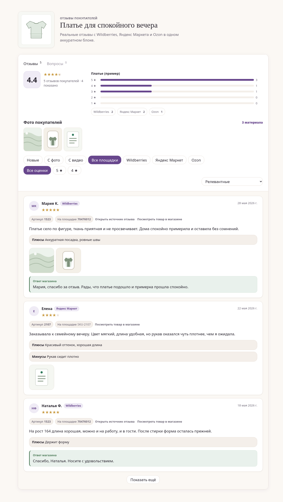
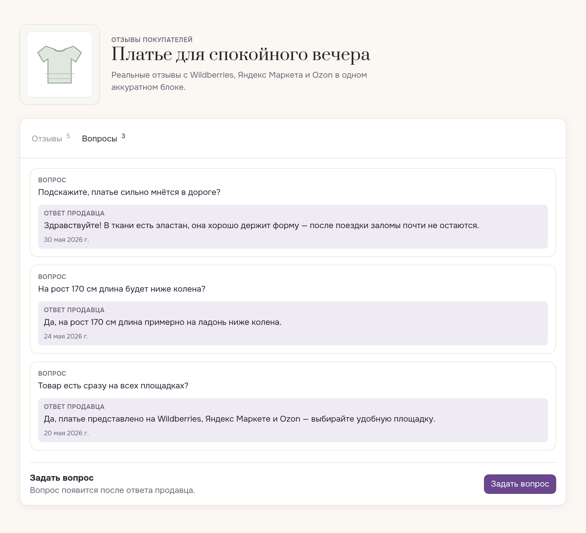
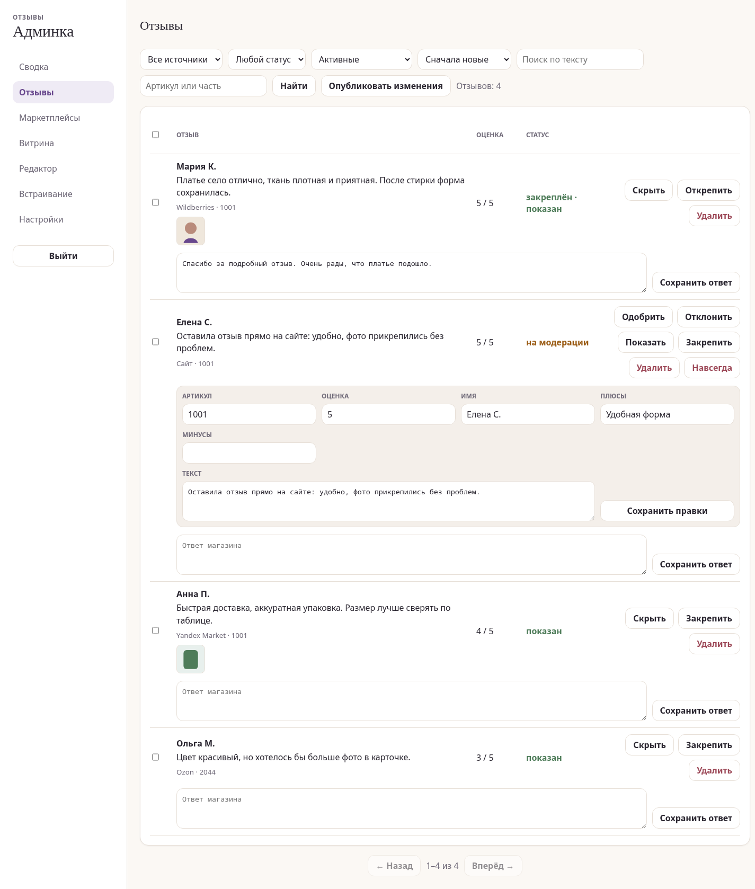
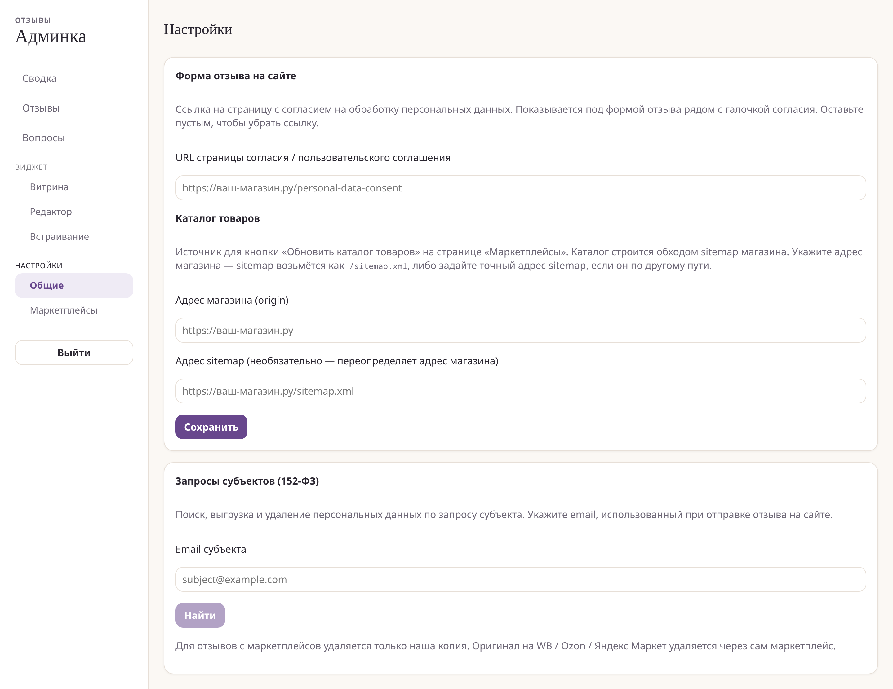
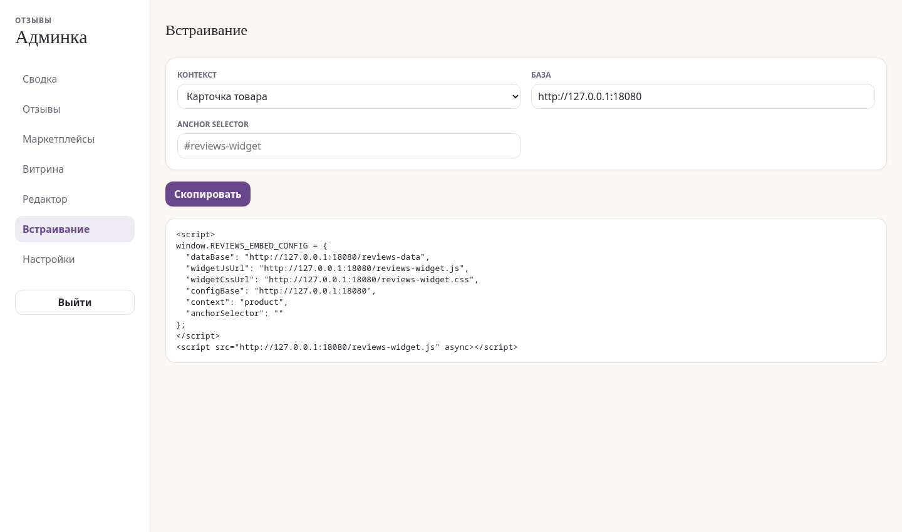

# Виджет отзывов

«Виджет отзывов» — автономный Go-сервис, который собирает отзывы о товарах продавца с
маркетплейсов (Wildberries, Яндекс Маркет; Ozon — за флагом, требует платной
подписки), хранит их в локальной базе, даёт админ-панель для модерации и
настройки и отдаёт виджет с отзывами для встраивания на сайт.

Один бинарник делает всё: мастер установки, миграции БД, синхронизацию,
HTTP-сервер, админку, экспорт статических данных и виджет.

**Быстрый старт:** скачайте бинарник, запустите `./reviews install`, заполните
мастер установки — сервис сам развернётся на VPS, включит HTTPS и покажет адрес
админки.

```sh
curl -fsSL https://raw.githubusercontent.com/marker-oss/yakit-reviews-extension/main/install.sh | sh
./reviews install
```

**Нужна установка под ключ, поддержка или доработка под конкретные задачи?**
Пишите в Telegram: [@pishite0suda](https://t.me/pishite0suda).

---

## Как выглядит

| Виджет на карточке товара | Вкладка «Вопросы» |
|---|---|
|  |  |

| Админка: отзывы и ответы | Настройки и запросы 152-ФЗ |
|---|---|
|  |  |

| Встраивание одним сниппетом |
|---|
|  |

---

## Для кого

«Виджет отзывов» рассчитан на селлеров, которым нужен собственный блок отзывов на сайте:

- магазин на **Яндекс Кит** или похожей платформе;
- отзывы уже есть на WB / Яндекс Маркете / Ozon, но на сайте хочется единый
  красивый виджет;
- данные должны храниться в своём инстансе, без SaaS-аккаунта и передачи базы
  отзывов третьей стороне;
- обычная работа после установки должна идти через админку, без правки кода.

**Что понадобится:** VPS или любой Docker-хост, API-токены маркетплейсов
(Wildberries / Яндекс Маркет; Ozon опционально), домен для виджета и сайт
магазина с sitemap (каталог из коробки заточен под **Яндекс Кит**). Всё
остальное — HTTPS, БД, синхронизация — сервис делает сам.

## Возможности

- Сбор отзывов из **Wildberries**, **Яндекс Маркета** и **Ozon**.
- Админка для модерации, скрытия спама, ответов магазина и ручного запуска
  синхронизации.
- Автоматическое сопоставление товаров сайта с артикулами через sitemap.
- Настраиваемый виджет: тема, раскладка, фильтры, сортировка, витрина и
  готовый сниппет для вставки.
- Форма отзывов с сайта: новые отзывы попадают на модерацию, медиа хранятся
  локально.
- Юридическая митигация: обезличивание имён, размывание лиц в медиа через
  прокси, шаблон политики обработки персональных данных.

---

## Содержание

1. [Как выглядит](#как-выглядит)
2. [Для кого](#для-кого)
3. [Возможности](#возможности)
4. [Самый простой путь: мастер установки](#самый-простой-путь-мастер-установки)
5. [Быстрый старт (Яндекс Кит)](#быстрый-старт-яндекс-кит)
6. [Требования](#требования)
7. [Установка](#установка)
8. [Настройка (.env)](#настройка-env)
9. [Первый запуск](#первый-запуск)
10. [CLI-команды](#cli-команды)
11. [Админ-панель](#админ-панель)
12. [HTTP API](#http-api)
13. [Встраивание виджета](#встраивание-виджета)
14. [Обслуживание](#обслуживание)
15. [Чек-лист для продакшена](#чек-лист-для-продакшена)
16. [Дополнительные материалы](#дополнительные-материалы)
17. [Лицензия и поддержка](#лицензия-и-поддержка)

---

## Самый простой путь: мастер установки

Мастер установки — самый простой способ развернуть сервис. Продавец скачивает
один файл, запускает его на своём компьютере, заполняет форму — и сервис
разворачивается на VPS автоматически. На самом сервере вручную ничего вводить не
нужно (SSH-доступ нужен только технически, мастер всё делает сам).

Если нужна помощь с установкой, настройкой маркетплейсов, встраиванием виджета
или доработкой системы под ваш сценарий, напишите:
[@pishite0suda](https://t.me/pishite0suda).

### Шаг 1. Скачать установщик

**Linux / macOS — одной командой** (сам определит ОС и архитектуру и скачает
нужный бинарник в текущую папку):
```sh
curl -fsSL https://raw.githubusercontent.com/marker-oss/yakit-reviews-extension/main/install.sh | sh
```

**Вручную** — выберите файл под свою систему на странице
[releases](https://github.com/marker-oss/yakit-reviews-extension/releases/latest):

| ОС | Файл |
|----|------|
| Linux x86-64 | `reviews-linux-amd64` |
| Linux ARM64 | `reviews-linux-arm64` |
| macOS Apple Silicon (M1/M2/M3) | `reviews-darwin-arm64` |
| macOS Intel | `reviews-darwin-amd64` |
| Windows x86-64 | `reviews-windows-amd64.exe` |

Пример для Linux:
```sh
curl -L -o reviews https://github.com/marker-oss/yakit-reviews-extension/releases/latest/download/reviews-linux-amd64
chmod +x reviews
```
На Windows — скачайте `.exe` из таблицы и запускайте из PowerShell.

> Нет готового релиза? Соберите бинарник из исходников (нужен Go 1.26+):
> ```sh
> git clone https://github.com/marker-oss/yakit-reviews-extension.git
> cd yakit-reviews-extension && go build -o reviews ./cmd/reviews
> ```

### Шаг 2. Подготовить требования (чеклист)

> Всё это нужно подготовить **до** запуска мастера. Самый частый затык — DNS:
> его проверка идёт **первым шагом**, и установка не начнётся, пока A-запись не
> указывает на IP сервера.

**1. VPS-сервер.**
- Чистый **Ubuntu или Debian** (мастер проверяет `/etc/os-release` — другие
  дистрибутивы не пройдут).
- Минимум ~512 МБ RAM (мастер тянет готовый образ из реестра — сборки из
  исходников на сервере нет).
- Свободные порты **80, 443** (Caddy/HTTPS) и **8080** (внутренний сервис) —
  без уже занятого Nginx/Caddy.
- Где взять: любой VPS-провайдер (Timeweb, Selectel, Beget, Aeza, Hetzner и
  т.п.), образ Ubuntu 22.04/24.04.

**2. SSH-доступ (root или sudo).**
- IP сервера, SSH-порт (обычно `22`), пользователь (обычно `root`).
- Способ входа — **пароль** ИЛИ **приватный SSH-ключ** (путь к файлу на своём
  компьютере, напр. `~/.ssh/id_ed25519`). Если пользователь не root — нужен
  sudo-пароль.
- Где взять: провайдер присылает доступы при создании сервера.

**3. Домен + DNS (настроить заранее!).**
- Поддомен под отзывы, напр. `reviews.ваш-магазин.ru`.
- Создайте **A-запись** `reviews` → IP вашего VPS в панели управления доменом и
  дождитесь применения (от минут до пары часов).
- HTTPS-сертификат получать **не нужно** — Caddy выпустит Let's Encrypt
  автоматически (для этого и нужна заранее настроенная A-запись).
- **Origin магазина** (`https://ваш-магазин.ru`) — адрес вашего основного сайта,
  куда встроится виджет; используется для CORS и шаблона ссылок на товар.

**4. Данные администратора.**
- Логин (по умолчанию `admin`) и пароль (≥ 8 символов) — придумываете сами.

**5. Ключи маркетплейсов** (только для тех площадок, что подключаете):

- **Wildberries** — API-токен. ЛК продавца → **Профиль → Настройки → Доступ к
  API** → создать токен с категорией **«Вопросы и отзывы»**. Скопируйте сразу —
  повторно токен не показывается.
- **Яндекс Маркет** — обязательны **Business ID** + (**Api-Key** ИЛИ
  OAuth-токен), опционально **Campaign ID**. Api-Key: партнёрский кабинет →
  **Настройки → API-ключи** → создать ключ с доступом к отзывам. Business ID —
  идентификатор кабинета (виден в URL и настройках). Campaign ID — идентификатор
  конкретного магазина.
- **Ozon** (по умолчанию выключен) — **Client-Id** + **Api-Key**. Личный кабинет
  → **Настройки → Seller API** → сгенерировать ключ; `Client-Id` показан рядом.
  При генерации ключа отметьте роли:
  - **«Отзывы»** — обязательна (методы отзывов; доступны продавцам с подпиской
    Premium Plus);
  - **«Товары»** — обязательна: по каталогу Ozon сервис сопоставляет отзывы с
    артикулами вашего сайта (`offer_id`). Без этой роли отзывы синхронизируются,
    но не привязываются к карточкам товаров — виджет будет показывать «0 отзывов»;
  - **«Вопросы»** — опционально, для раздела «Вопросы и ответы».

  Ключ показывается один раз — сохраните его сразу. Если ключ уже создан без
  роли «Товары», сгенерируйте новый с нужными ролями и замените в админке
  (Маркетплейсы): привязка существующих отзывов к артикулам произойдёт
  автоматически при ближайшей синхронизации.

> UI кабинетов маркетплейсов периодически меняется — ключи всегда в разделе
> «API / интеграции» настроек продавца.

### Шаг 3. Запустить мастер

```sh
./reviews install
```

Мастер по экранам спросит: доступ к серверу (IP/порт/пользователь + пароль или
SSH-ключ), домены (сервис отзывов + origin магазина), логин/пароль первого
администратора, ключи и флаги включения WB / Яндекс Маркета / Ozon.

После подтверждения installer всё делает сам:
1. проверяет DNS (домен указывает на IP) и SSH-доступ, что ОС — Ubuntu/Debian;
2. проверяет, что порты `80/443/8080` свободны;
3. ставит Docker и Caddy;
4. клонирует исходники, пишет `.env`, `docker-compose.override.yml` и `Caddyfile`;
5. тянет готовый образ (`docker compose pull`), поднимает сервис и перезагружает Caddy;
6. дожидается `/healthz`, создаёт администратора, сохраняет ключи маркетплейсов;
7. запускает первую синхронизацию, обновляет каталог и публикует данные.

В конце мастер печатает адрес админки (`https://reviews.ваш-магазин.ru/admin`) и
подсказку: открыть **Админка → Встраивание** и скопировать сниппет виджета.

Ручные инструкции ниже остаются как прозрачный fallback для тех, кто хочет
контролировать установку сам.

---

## Быстрый старт (Яндекс Кит)

Пошаговый сценарий для продавца с магазином на платформе **Яндекс Кит**.
После установки всё настраивается через админ-панель — код трогать не нужно.

1. **Подготовьте сервер и домены.** Небольшой VPS с Docker. Заведите поддомен
   для сервиса отзывов (например `reviews.ваш-магазин.ru`) и направьте его
   A-записью на IP сервера. HTTPS получит reverse proxy (Caddy сам выпустит
   сертификат — см. [Установка](#установка) и [deploy/](deploy/)).

2. **Заполните `.env`** (`cp .env.example .env`):
   - токены маркетплейсов (`REVIEWS_WB_TOKEN` / `REVIEWS_YM_API_KEY` +
     `REVIEWS_YM_BUSINESS_ID`) и включите нужные (`*_ENABLED=true`);
   - `REVIEWS_SHOP_ORIGIN=https://ваш-магазин.ru` — без этого виджет не сможет
     забрать данные кросс-доменно;
   - `REVIEWS_PUBLIC_DOMAIN=reviews.ваш-магазин.ru` (для VPS-Caddyfile);
   - `REVIEWS_SITE_SITEMAP_URL` можно не задавать — по умолчанию берётся
     `REVIEWS_SHOP_ORIGIN` + `/sitemap.xml`.

3. **Запустите:** `docker compose up -d --build`, проверьте `GET /healthz`.

   > **HTTPS обязателен.** Магазин работает по `https`, поэтому браузер молча
   > заблокирует виджет, загружаемый по `http` (mixed content) — без ошибок на
   > странице. Поставьте перед сервисом reverse proxy с сертификатом, проще
   > всего Caddy: `reviews.ваш-магазин.ru { reverse_proxy 127.0.0.1:8080 }` —
   > сертификат Let's Encrypt он выпустит и продлит сам (см. [deploy/Caddyfile](deploy/Caddyfile)).

4. **Создайте администратора:** откройте `/admin` — на первом запуске будет
   экран первичной настройки (логин + пароль).

5. **Наполните данные кнопками в админке** (без терминала):
   - **Маркетплейсы → «Синхронизировать всё»** — подтянуть отзывы;
   - **Маркетплейсы → «Обновить каталог товаров»** — сопоставить товары
     магазина с артикулами по sitemap;
   - при необходимости настройте вид виджета в **Редакторе**.

6. **Встройте виджет:** на странице **Встраивание** скопируйте готовый сниппет
   и вставьте его в Яндекс Тег Менеджер (Custom HTML, на всех страницах /
   DOM Ready). Два условия, без которых тег не выполнится на сайте:
   контейнер Тег Менеджера должен быть **подключён к сайту** (интеграция в
   настройках Кита / код контейнера на страницах) и **опубликован** — «Сохранить»
   у тега недостаточно, изменения попадают на сайт только после публикации
   версии контейнера. Проверка: скрипт контейнера виден в DOM страницы.
   После этого виджет сам появится на карточках товаров.

Дальше — только обычная работа в админке: модерация отзывов, витрина, а при
добавлении новых товаров — кнопка «Обновить каталог товаров».

---

## Требования

| Компонент | Версия | Зачем |
|-----------|--------|-------|
| Docker + Docker Compose | современный | рекомендуемый способ запуска |
| Go | 1.26+ | только для сборки из исходников |
| Node.js | 22+ | только для пересборки админ-панели (SPA) |
| SQLite | встроена | БД по умолчанию, отдельная установка не нужна |
| PostgreSQL | 13+ | опционально, вместо SQLite |

Ключи доступа к маркетплейсам (получаются в личном кабинете продавца):
- **Wildberries** — API-токен;
- **Яндекс Маркет** — `Api-Key` и `businessId`;
- **Ozon** — `Client-Id` и `Api-Key` (по умолчанию выключен).

---

## Установка

### Вариант A — Docker (рекомендуется)

```sh
git clone https://github.com/marker-oss/yakit-reviews-extension.git reviews
cd reviews

# 1. Подготовьте конфигурацию
cp .env.example .env
# отредактируйте .env (см. раздел «Настройка»)

# 2. Соберите и запустите
docker compose up -d --build

# 3. Проверьте, что сервис жив
curl http://localhost:8080/healthz
```

Что делает compose:
- собирает фронтенд (Vite) и Go-бинарник в multistage-образе (distroless, nonroot);
- запускает `serve --addr 0.0.0.0:8080 --with-sync` — сервер + встроенный
  планировщик синхронизации;
- хранит SQLite-базу на именованном томе `reviews-data` (`/data/reviews.db`),
  данные переживают пересоздание контейнера.

Управление:
```sh
docker compose logs -f reviews
docker compose restart reviews
docker compose down            # остановить (том с данными сохраняется)
```

### Вариант B — из исходников (без Docker)

```sh
git clone https://github.com/marker-oss/yakit-reviews-extension.git reviews
cd reviews
cp .env.example .env           # отредактируйте

# Собрать бинарник
go build -o reviews ./cmd/reviews

# Применить миграции БД
./reviews migrate

# Запустить сервер (локально, с синхронизацией)
./reviews serve --addr 127.0.0.1:8080 --with-sync
```

> **Локальный HTTP:** для запуска без HTTPS обязательно укажите в `.env`
> `REVIEWS_INSECURE_COOKIES=1`, иначе куки сессии получат флаг `Secure` и вход
> в админку не сработает. В продакшене за HTTPS — оставьте переменную пустой.

Если меняли код фронтенда — пересоберите SPA перед сборкой бинарника:
```sh
cd web/admin && npm ci && npm run build && cd ../..
# затем скопируйте dist в ассеты сервера согласно скриптам в deploy/
```

---

## Настройка (.env)

Все настройки задаются переменными окружения (или файлом `.env` в корне).
Полный пример — в [.env.example](.env.example).

### База данных
| Переменная | По умолчанию | Описание |
|-----------|--------------|----------|
| `REVIEWS_DB_DRIVER` | `sqlite` | `sqlite` или `postgres` |
| `REVIEWS_DB_DSN` | `./reviews.db` | путь к файлу SQLite или DSN Postgres. В Docker принудительно `/data/reviews.db` |

DSN для Postgres:
`host=db user=reviews password=secret dbname=reviews port=5432 sslmode=disable`

### Синхронизация (для `serve --with-sync` и `sync`)
| Переменная | По умолчанию | Описание |
|-----------|--------------|----------|
| `REVIEWS_SYNC_INTERVAL` | `1h` | период автосинхронизации |
| `REVIEWS_SYNC_BACKFILL_MONTHS` | `12` | глубина первичной загрузки (мес.) |
| `REVIEWS_SYNC_OVERLAP` | `1h` | перехлёст окна, чтобы не терять отзывы |

### Логи и безопасность
| Переменная | По умолчанию | Описание |
|-----------|--------------|----------|
| `REVIEWS_LOG_LEVEL` | `info` | `debug` / `info` / `warn` / `error` |
| `REVIEWS_LOG_FORMAT` | `json` | `json` или `text` |
| `REVIEWS_INSECURE_COOKIES` | — | `1` → разрешить куки по HTTP (только локально). За HTTPS оставьте пустым |

### Сайт / виджет
| Переменная | По умолчанию | Описание |
|-----------|--------------|----------|
| `REVIEWS_SITE_PRODUCT_URL_TEMPLATE` | — | шаблон ссылки на товар, `{seller_article_url}` подставляется |
| `REVIEWS_SITE_PRODUCT_LINKS` | `data/product-links.json` | файл с точными ссылками на товары (приоритетнее шаблона) |
| `REVIEWS_SHOP_ORIGIN` | — | **origin вашего магазина** (со схемой, без слэша), которому разрешено забирать данные виджета кросс-доменно (CORS). Несколько — через запятую. Необязателен, если адрес магазина указан в админке (Настройки → «Адрес магазина», www-вариант разрешается автоматически); env и админ-настройка объединяются |
| `REVIEWS_PUBLIC_DOMAIN` | — | публичный хост, раздающий виджет/данные (используется только Caddyfile в VPS-деплое) |
| `REVIEWS_SITE_SITEMAP_URL` | первый `REVIEWS_SHOP_ORIGIN` + `/sitemap.xml` | sitemap магазина для сопоставления страниц товаров с артикулами. Используется кнопкой «Обновить каталог товаров» в админке и командой `discover-site-urls` |
| `REVIEWS_PRIVACY_URL` | — | ссылка на политику обработки данных в форме «Оставить отзыв» |
| `REVIEWS_REVIEW_TERMS_URL` | — | ссылка на правила публикации отзывов в форме |
| `REVIEWS_UPLOAD_DIR` | `data/review-uploads` или `/data/review-uploads` в Docker | локальное хранилище фото/видео, загруженных через форму |
| `REVIEWS_AUTOPUBLISH_INTERVAL` | `5m` | как часто автопубликация проверяет, изменились ли данные (синк, модерация, конфиг виджета, каталог), и перегенерирует статический экспорт. `0`/`off` — отключить (публиковать только кнопкой) |
| `REVIEWS_CATALOG_REFRESH_INTERVAL` | `24h` | период фонового инкрементального обхода sitemap магазина (новые товары попадают в каталог сами). `0`/`off` — отключить |

> **CORS.** Сам сервис (`serve`) проставляет CORS-заголовки для публичных
> эндпоинтов и статики: разрешаются origin'ы из `REVIEWS_SHOP_ORIGIN` плюс
> адрес магазина из админки (Настройки → «Адрес магазина», применяется без
> рестарта) — при Docker-запуске (или любом reverse proxy перед контейнером)
> отдельная настройка CORS не нужна. В VPS-деплое статику раздаёт Caddy — там
> админ-настройка на статику не действует, значения берутся из окружения Caddy
> (см. [deploy/Caddyfile](deploy/Caddyfile)).

### Маркетплейсы
Каждый включается флагом `*_ENABLED=true` **после** заполнения ключей.

| Wildberries | Яндекс Маркет | Ozon (выключен) |
|-------------|---------------|-----------------|
| `REVIEWS_WB_ENABLED` | `REVIEWS_YM_ENABLED` | `REVIEWS_OZON_ENABLED` |
| `REVIEWS_WB_TOKEN` | `REVIEWS_YM_API_KEY` | `REVIEWS_OZON_CLIENT_ID` |
| | `REVIEWS_YM_BUSINESS_ID` | `REVIEWS_OZON_API_KEY` |
| | `REVIEWS_YM_CAMPAIGN_ID` (опц.) | |

---

## Первый запуск

1. **Применить миграции** (Docker делает это сам при старте):
   ```sh
   ./reviews migrate
   ```
2. **Запустить сервер:**
   ```sh
   ./reviews serve --with-sync         # или docker compose up -d
   ```
3. **Создать администратора.** Откройте `http://localhost:8080/admin` — при
   первом запуске SPA покажет экран **первичной настройки**. Задайте логин и
   пароль (минимум 8 символов). Повторно создать админа через этот экран
   нельзя — эндпоинт вернёт 409, если админ уже существует.

   Альтернатива / сброс пароля через CLI:
   ```sh
   ./reviews admin reset-password --login admin --password НОВЫЙ_ПАРОЛЬ
   ```
   (сбрасывает пароль и завершает все активные сессии пользователя)

4. **Войти** на `/admin` под созданными логином и паролем.

---

## CLI-команды

```sh
reviews migrate
    Применить миграции схемы БД.

reviews install
    Открыть локальный TUI-мастер установки на свежий Ubuntu/Debian VPS.

reviews admin reset-password --login admin --password NEW
    Сменить пароль администратора и разлогинить его сессии.

reviews sync --once [--marketplace wb|ym|ozon]
    Разовая синхронизация. Без --marketplace — все включённые.

reviews serve [--addr 127.0.0.1:8080] [--with-sync]
              [--static-dir web/reviews-widget]
              [--product-url-template "..."]
    HTTP-сервер. --with-sync включает фоновый планировщик.

reviews discover-site-urls --sitemap URL [--out data/...json] [--timeout 30m]
    Сопоставить SKU продавца с точными ссылками из sitemap сайта.
    --sitemap обязателен. Магазин на 4500 товаров обходится ~10 минут;
    если таймаут всё же истёк, частичный каталог сохраняется, а повторный
    запуск (как и кнопка в админке) докачивает только недостающие товары.
    В админке это же действие доступно кнопкой «Обновить каталог товаров».

reviews export [--out web/reviews-data]
    Выгрузить отзывы в статические JSON-бандлы (для CDN/статик-хостинга).
```

---

## Админ-панель

Доступна на `/admin` после входа. Основные разделы:

- **Дашборд** — сводка: количество отзывов, статусы, состояние синхронизации
  по маркетплейсам.
- **Отзывы** — список с фильтрами, модерация: одобрение/скрытие отзыва.
- **Маркетплейсы** — статус подключения (включён / настроен), кнопка ручного
  запуска синхронизации и кнопка **«Обновить каталог товаров»** (перечитывает
  sitemap магазина и обновляет сопоставление товаров с артикулами — без
  терминала). Обход идёт в фоне с прогрессом «N из M товаров» и добавляет
  только новые товары; «Пересканировать полностью» заново обходит весь каталог.
- **Витрина (Showcase)** — правило отбора отзывов для виджета (рейтинг, наличие
  фото и т.п.).
- **Редактор виджета (Editor)** — визуальная настройка темы, раскладки,
  типографики, видимости элементов и публичной выдачи по площадкам: можно скрыть
  отзывы выбранного источника, заменить его подпись и отключить ссылки на
  источник отзыва. Публикация версионная, есть откат к предыдущей версии.
- **Встраивание (Embed)** — готовый сниппет для вставки виджета на сайт.

Все изменяющие запросы защищены сессией и CSRF-токеном (double-submit cookie).

---

## HTTP API

### Публичные (без авторизации)
| Метод | Путь | Назначение |
|-------|------|-----------|
| GET | `/api/reviews` | отзывы (фильтры: `marketplace`, `rating`, `offset`) |
| GET | `/api/showcase` | отзывы для витрины по правилу showcase |
| GET | `/api/widget-config` | опубликованная конфигурация виджета |
| GET | `/api/review-submission-config` | настройки формы отзыва: лимиты, MIME-типы, ссылки на соглашения |
| POST | `/api/review-submissions` | отправка отзыва с сайта (`multipart/form-data`, статус `pending`) |
| GET | `/user-media/{token}` | локальные медиа site-отзывов; публично только после одобрения |
| GET | `/healthz` | health-check |
| GET | `/` | статика виджета (`--static-dir`) |

### Админские (`/admin/api/`, требуют сессию + CSRF на запись)
`setup-status`, `setup`, `login`, `logout`, `me`, `csrf`, `reviews`,
`reviews/{id}` (PATCH), `dashboard`, `marketplaces`, `sync` (POST),
`reviews/{id}/purge` (DELETE), `showcase-rule` (GET/PUT), `widget-config/{context}` (GET/POST),
`widget-config/{context}/versions`, `widget-config/{context}/rollback/{version}`.

---

## Встраивание виджета

Продакшен-путь — статический (быстрый, без нагрузки на сервис):

1. Выгрузить данные в JSON-бандлы:
   ```sh
   reviews export --out web/reviews-data
   ```
2. Раздавать по HTTPS файлы `loader.js`, `reviews-widget.js`,
   `reviews-widget.css` и папку `reviews-data/` (Caddy/Nginx или CDN).
3. Подключить `loader.js` на странице товара (можно через Яндекс Тег Менеджер:
   Custom HTML, на всех страницах / DOM Ready).
4. `loader.js` сам отслеживает SPA-навигацию, достаёт SKU товара со страницы,
   подгружает `reviews-data/by-article/<sku>.json`, находит точку монтирования
   (см. ниже), вставляет виджет и добавляет JSON-LD-разметку для SEO.

### Куда монтируется виджет (секция-якорь)

`loader.js` ищет точку монтирования по двум стратегиям, по приоритету:

1. **Секция-якорь (рекомендуется).** Пустой HTML-элемент, который вы сами
   размещаете на странице там, где должен появиться виджет:
   - на карточке товара — `id="reviews-widget"`;
   - на главной — `id="reviews-homepage"`.

   ```html
   <div id="reviews-widget"></div>
   ```

   Виджет монтируется **внутрь** этого элемента. Опционально можно передать
   артикул атрибутом `data-article` — тогда SKU берётся прямо с якоря, без опоры
   на каталог по sitemap и контекст страницы:

   ```html
   <div id="reviews-widget" data-article="ВАШ-SKU"></div>
   ```

2. **Автопривязка (fallback).** Если якоря на странице нет, `loader.js` ищет
   штатный блок карточки товара Яндекс Кита (`[data-testid="ProductDetails"]`) и
   вставляет виджет **сразу после** него. Способ рабочий, но зависит от вёрстки
   Кита: если платформа изменит этот блок или его не окажется на странице —
   виджет не появится. Поэтому для надёжности предпочтителен явный якорь.

> **Как добавить якорь на Яндекс Кит.** Секция-якорь — это **не** тег-менеджер, а
> HTML-блок внутри самой страницы. В конструкторе Кита добавьте на шаблон карточки
> товара блок с произвольным кодом (Custom HTML) с содержимым
> `<div id="reviews-widget"></div>` в нужном месте. Тег-менеджер при этом только
> подгружает `loader.js` — монтирование в найденный якорь делает уже он.

Если Кит оборачивает ваш блок в свой контейнер или вы используете другой
селектор, укажите его в **Админка → Встраивание → Anchor selector** — значение
попадёт в `REVIEWS_EMBED_CONFIG.anchorSelector` и добавится в список кандидатов
поиска.

По умолчанию виджет монтируется в Shadow DOM. Для проверки отображения в
Вебвизоре можно временно добавить в `window.REVIEWS_EMBED_CONFIG`:

```js
useShadowDom: false
```

В этом режиме CSS виджета добавляется в документ, а виджет рендерится обычной
разметкой страницы.

Альтернативно виджет может ходить напрямую в `GET /api/reviews` живого сервиса
(динамический режим) — удобно для теста, см.
[web/reviews-widget/demo.html](web/reviews-widget/demo.html).

### Виджет не отображается — чек-лист

Проверяйте слои по порядку, каждый следующий не работает без предыдущего.
Всё смотрится в DevTools браузера (F12) на странице товара:

1. **Тег-менеджер доставляет код?** В DOM должен быть скрипт контейнера
   Тег Менеджера и inline-скрипт с `window.REVIEWS_EMBED_CONFIG`. Если их нет —
   контейнер не подключён к сайту или не опубликован (см. Быстрый старт, шаг 6).
2. **loader.js загружается?** Во вкладке Network должен быть успешный запрос
   `loader.js` с сервера отзывов. Красный со статусом `(blocked:mixed-content)`
   или ошибка сертификата — сервер отзывов работает без HTTPS, начните с этого.
   В сниппете подключается именно `loader.js` (не `reviews-widget.js` — тот
   только рендерер и сам ничего не монтирует).
3. **CORS настроен?** Ошибки `blocked by CORS policy` в консоли (симптом на
   странице: виджет без стилей или с заголовком и нулём отзывов) — сервер
   отзывов не знает адрес магазина. Проще всего: админка → Настройки → «Адрес
   магазина» → Сохранить (www-вариант домена разрешится автоматически, рестарт
   не нужен). Альтернатива для ops: `REVIEWS_SHOP_ORIGIN` в `.env` — значение
   должно точно совпадать с адресом магазина, включая `https://`.
4. **Данные существуют?** `https://сервер-отзывов/reviews-data/links.json`
   должен открываться в браузере. Обычно данные публикуются сами: экспорт
   перегенерируется автоматически после синка/модерации (каждые ~5 минут при
   изменениях), каталог обходится раз в сутки. 404 сразу после установки —
   подождите первого цикла или ускорьте вручную: Маркетплейсы → «Обновить
   каталог товаров», затем «Опубликовать».
5. **Якорь и артикул.** Добавьте в `REVIEWS_EMBED_CONFIG` строку `debug: true` —
   loader начнёт писать в консоль `[reviews-widget] …`: `no anchor` — на
   странице нет якоря и стандартного блока Кита; `no article for …` — путь не
   найден в каталоге (обновите каталог); `rendered N reviews` — всё работает.
6. **Кэш.** `loader.js` кэшируется на час — после исправлений делайте жёсткую
   перезагрузку (Ctrl+Shift+R) или проверяйте в инкогнито.

---

## Обслуживание

**Обновление до новой версии** (данные — БД и каталог товаров — живут на томе
`/data` и при обновлении сохраняются):

```sh
# Установка мастером или GHCR-образ (docker-compose.override.yml):
docker compose pull && docker compose up -d

# Ручной Docker со сборкой из исходников:
git pull && docker compose up -d --build

# Бинарник без Docker: скачать новый файл со страницы releases и перезапустить.
```

О новых версиях: админка сама показывает баннер «Доступна новая версия»
(проверка раз в сутки; отключается `REVIEWS_UPDATE_CHECK=false` в `.env`).
Дополнительно можно нажать **Watch → Custom → Releases** на GitHub-странице
проекта — придёт уведомление на почту. Текущую версию показывает команда
`reviews version`.

**Автообновления (опционально).** Мастер установки включает их по умолчанию
(на странице Review отключаются клавишей `u`): systemd-таймер раз в сутки
(~04:00 + случайная задержка) запускает `/usr/local/bin/reviews-auto-update` —
скрипт скачивает новый образ, перезапускает сервис только если образ изменился,
ждёт `healthz` и **автоматически откатывается** на предыдущую версию, если
сервис не поднялся. Выключить: `systemctl disable --now reviews-update.timer`;
журнал: `journalctl -u reviews-update.service`.

Для ручной установки то же самое ставится тремя файлами из
[deploy/](deploy/): скопируйте `auto-update.sh` в
`/usr/local/bin/reviews-auto-update` (chmod +x), `reviews-update.service` и
`reviews-update.timer` в `/etc/systemd/system/` (поправьте
`REVIEWS_COMPOSE_DIR` на каталог с `docker-compose.yml`), затем
`systemctl daemon-reload && systemctl enable --now reviews-update.timer`.
Работает для установки с GHCR-образом; при сборке из исходников обновляйтесь
вручную через `git pull`.

**Бэкап БД (SQLite):**
```sh
docker compose exec reviews sh -c 'cp /data/reviews.db /data/reviews.backup.db'
# или копировать том reviews-data целиком
```

**Ручная синхронизация** — из админки (кнопка) или CLI:
```sh
./reviews sync --once --marketplace ym
```

**Логи** — структурированные (JSON по умолчанию):
```sh
docker compose logs -f reviews
```

---

## Чек-лист для продакшена

- [ ] Сервис за HTTPS (reverse proxy: Caddy/Nginx), `REVIEWS_INSECURE_COOKIES`
      **пустой** (куки `Secure`).
- [ ] Заполнены и включены ключи нужных маркетплейсов (`*_ENABLED=true`).
- [ ] Создан администратор с надёжным паролем.
- [ ] Том с БД (`reviews-data`) включён в регулярный бэкап.
- [ ] Проверен `GET /healthz` и первый прогон `sync --once`.
- [ ] При раздельной раздаче виджета — настроен `export` (по cron/CI) и
      HTTPS-хостинг статики.

---

## Дополнительные материалы

- Деплой и CI/CD: [deploy/](deploy/), [.github/workflows](.github/workflows)

---

## Лицензия и поддержка

Лицензия — **Apache 2.0**, см. [LICENSE](LICENSE). Можно свободно
разворачивать у себя, изменять и использовать в коммерческих целях.

Установка под ключ, поддержка и доработка системы под конкретные задачи — по
запросу в Telegram: [@pishite0suda](https://t.me/pishite0suda).

---

## Юридический чек-лист

Перед публикацией виджета убедитесь, что вы:

- [ ] Имеете право переопубликовывать отзывы со своих карточек (проверьте условия
      API соответствующего маркетплейса).
- [ ] Разместили политику конфиденциальности — шаблон в
      [docs/legal/privacy-policy-template.ru.md](docs/legal/privacy-policy-template.ru.md),
      и указали контакт в `REVIEWS_PRIVACY_CONTACT`.
- [ ] Понимаете, что скрытие отзывов предназначено только для спама/дублей.
      Сокрытие негатива ради рейтинга — риск по ЗоЗПП и закону «О рекламе» (ФАС).

Сервис минимизирует персональные данные автоматически: имя обезличивается
(«Анна К.»), лица на фото размываются в виджете, «сырой» ответ маркетплейса и
медиафайлы не хранятся.
